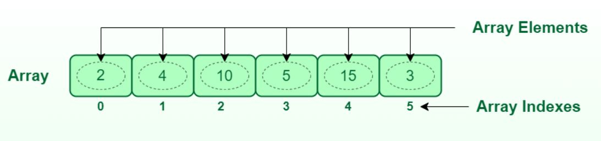

# Linked list vs Array

The purpose of this repository is to make a comparison between linked lists and arrays in Python.
Before to do so, we need to define and understand what they are. So let's dive into it.

## What is a linked list?
It is a type of linear data structure that is used to store data in an organized way. In a linked list each element is a node. Each node contains two parts: data (value of the element) and a reference to the next node in the sequence.

There different types of linked list such as sigle-linked list, double-linked list or circular-linked list. 
- In this case, I am going to use a **single-linked list** in which traversing is done in a forward direction.

- Here you can see the graphical representation:

*The image was taken from the website [Geeksforgeeks](https://www.geeksforgeeks.org/)*

## What is an array?
It is a data structure that is used to store a collection of items at contiguous memory locations. Its constraint is that all the elements should be of the same type. Also, each data element can be accessed directly by only using its index number.

Here you can see the graphical representation:

*This image was taken from the website [Geeksforgeeks](https://www.geeksforgeeks.org/)*

## Comparison

For this comparison we were asked to develop a Python script that compares the execution time each data structure takes to insert elements.
You can find the that script in the folder called scripts.

- **Considerations**
    - The script only contains methods for insertion of both data structures 

**The graph below shows the results of the comparison:**

You can see how at the beginning the time is almost equal, but as the number of elements increases the time execution of the linked list also increases.